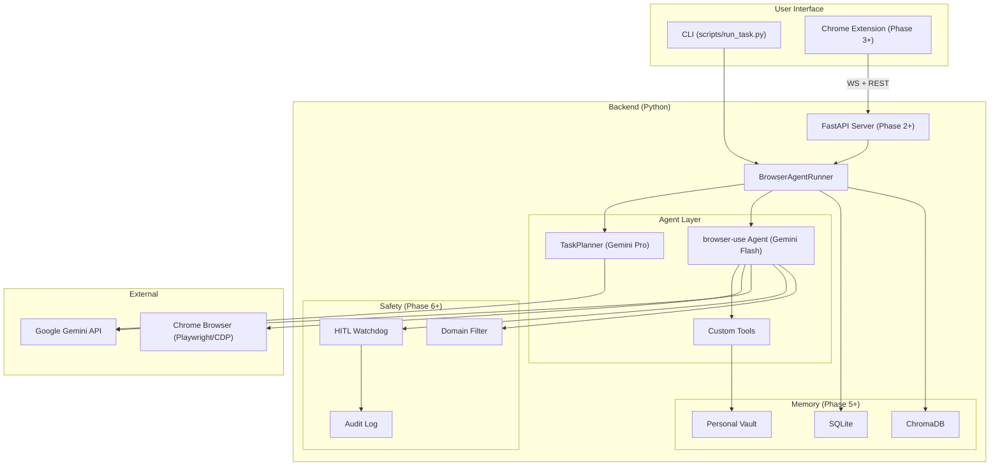
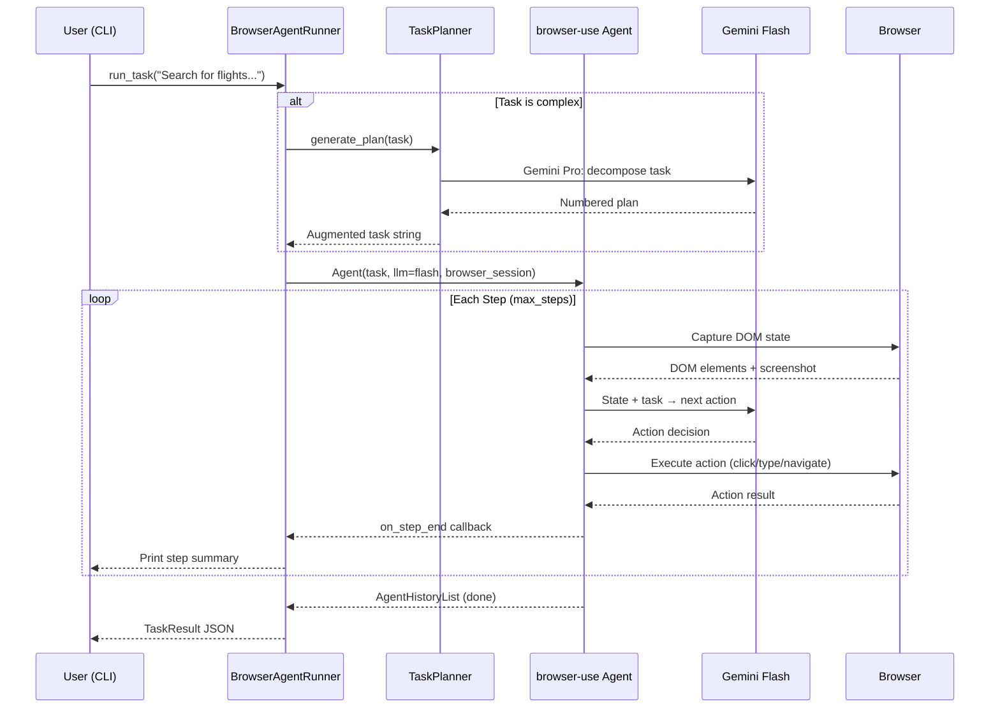

# Architecture Overview

## High-Level Diagram

## Phase 1 Data Flow

## Key Components (Phase 1)

| Component | File | Responsibility |
|-----------|------|----------------|
| Settings | `src/config.py` | Load env vars, provide typed config |
| LLM Factory | `src/agent/llm.py` | Create Gemini Flash / Pro instances |
| Prompts | `src/agent/prompts.py` | System messages, templates |
| Planner | `src/agent/planner.py` | Complex task decomposition via Pro |
| Tools | `src/agent/tools.py` | Custom browser-use actions |
| Runner | `src/agent/core.py` | Orchestrate agent lifecycle |
| Models | `src/models/task.py` | Pydantic schemas for tasks/results |
| CLI | `scripts/run_task.py` | Command-line entry point |
